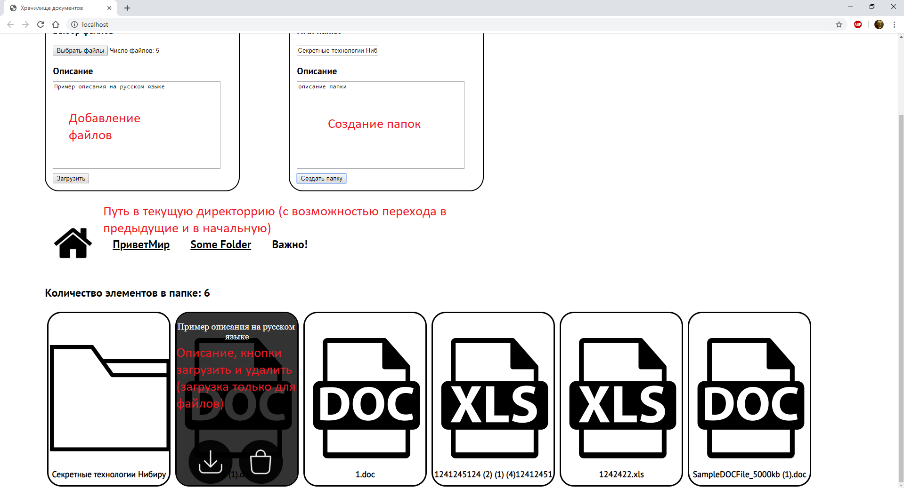

# Реализация простого файлового сервера (для документов doc, xls) на asp.net core
Описание функциональных требований содержится в файле "ТЗ.docx".
Инструкция по установке содержится в файле "Инструкция по установке Documentation center в ОС Windows 10 на сервер iis.docx".
Помимо описанных в тз требований, сервер содержит вложенную структуру папок и файлов.

Важно: сервер не использует валидацию строк, содержащих путь (пользователь не имеет к ним прямого доступа). При использовании на продакшне рекомендуется добавить валидацию для обеспечения большей безопасности.

